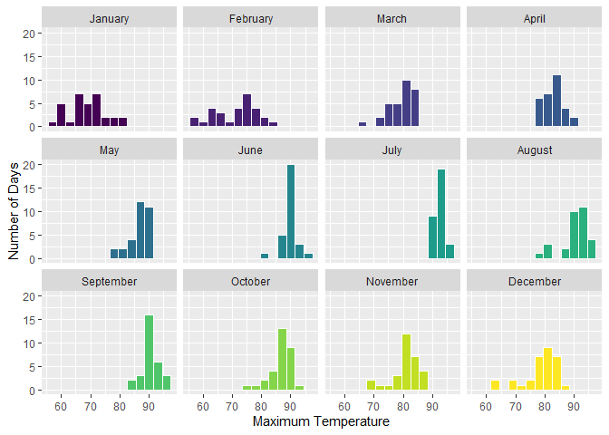
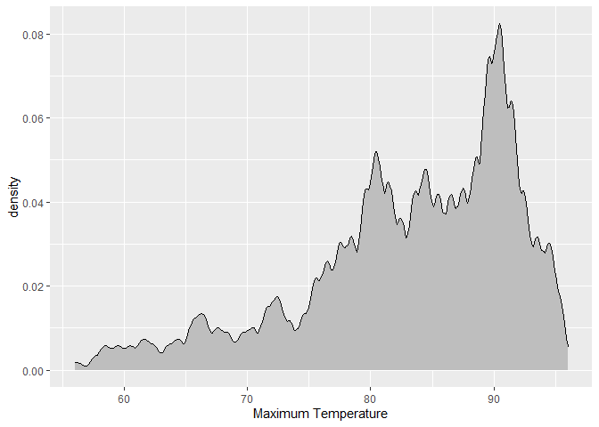
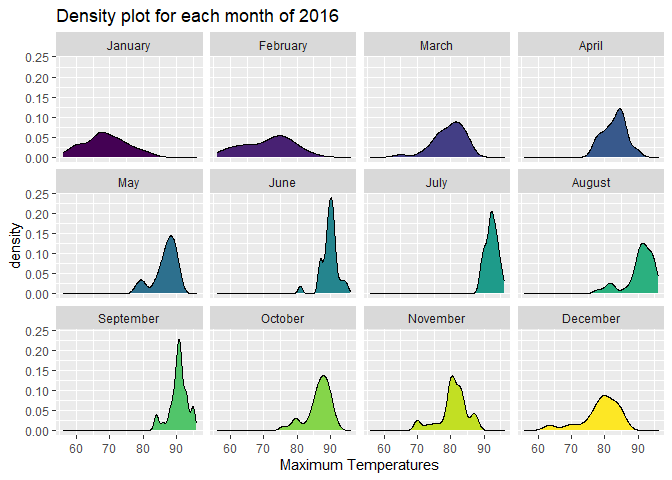
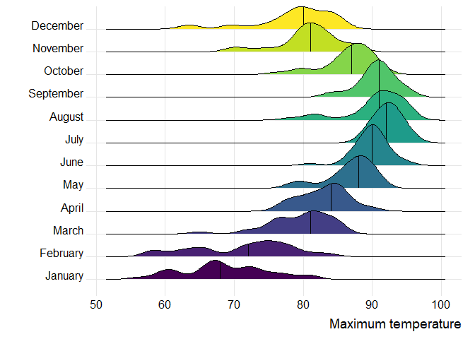
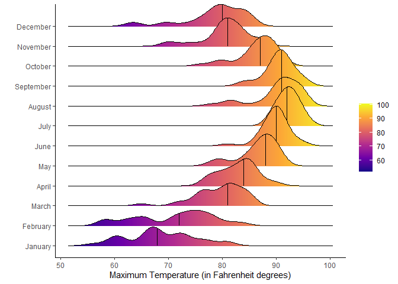
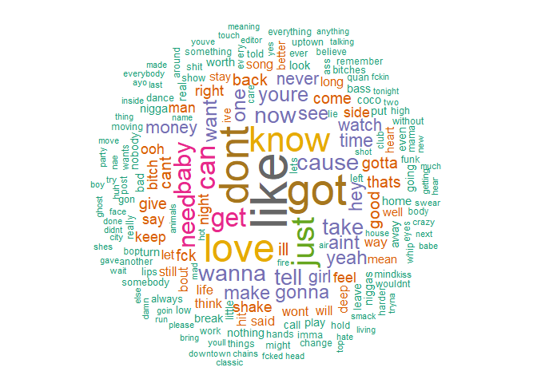

# Data Visualization Project 03


In this exercise you will explore methods to visualize text data and practice how to recreate charts that show the distributions of a continuous variable. 


## Part 1: Density Plots

Using the dataset obtained from FSU's [Florida Climate Center](https://climatecenter.fsu.edu/climate-data-access-tools/downloadable-data), for a station at Tampa International Airport (TPA) from 2016 to 2017, attempt to recreate the charts shown below


```r
library(tidyverse)
weather_tpa <- read_csv("https://github.com/reisanar/datasets/raw/master/tpa_weather_16_17.csv")
# random sample 
sample_n(weather_tpa, 4)
```

```
## # A tibble: 4 × 6
##    year month   day precipitation max_temp min_temp
##   <dbl> <dbl> <dbl>         <dbl>    <dbl>    <dbl>
## 1  2016     9    28          0.28       88       75
## 2  2016     4    29          0          90       71
## 3  2016     9    26          0          90       76
## 4  2016     7     2          0.3        90       77
```


```r
weather_tpa <- weather_tpa %>%
  mutate(month=as_factor(month)) 

levels(weather_tpa$month) <- c("January", "February", "March", "April", "May", "June", "July", "August", "September", "October", "November", "December")
weather_tpa
```

```
## # A tibble: 367 × 6
##     year month     day precipitation max_temp min_temp
##    <dbl> <fct>   <dbl>         <dbl>    <dbl>    <dbl>
##  1  2016 January     1          0          81       70
##  2  2016 January     2          0          73       59
##  3  2016 January     3          0.18       61       50
##  4  2016 January     4          0          66       49
##  5  2016 January     5          0          68       49
##  6  2016 January     6          0          67       54
##  7  2016 January     7          0          72       56
##  8  2016 January     8          0.54       76       63
##  9  2016 January     9          0.65       78       62
## 10  2016 January    10          0          72       56
## # … with 357 more rows
```

```r
str(weather_tpa)
```

```
## tibble [367 × 6] (S3: tbl_df/tbl/data.frame)
##  $ year         : num [1:367] 2016 2016 2016 2016 2016 ...
##  $ month        : Factor w/ 12 levels "January","February",..: 1 1 1 1 1 1 1 1 1 1 ...
##  $ day          : num [1:367] 1 2 3 4 5 6 7 8 9 10 ...
##  $ precipitation: num [1:367] 0 0 0.18 0 0 0 0 0.54 0.65 0 ...
##  $ max_temp     : num [1:367] 81 73 61 66 68 67 72 76 78 72 ...
##  $ min_temp     : num [1:367] 70 59 50 49 49 54 56 63 62 56 ...
```

(a) Recreate the plot below:


```r
#library(viridis)
#library(viridisLite)
ggplot(data=weather_tpa, aes(max_temp)) + 
  geom_histogram(aes(fill=month),color="white",binwidth = 3,show.legend = FALSE)+
  facet_wrap(~month)+
#  scale_color_viridis(discrete = TRUE) +
#  scale_fill_brewer(palette = "Dark2")+
  xlab("Maximum Temperature") +
  ylab("Number of Days")+
  scale_fill_viridis_d()
```

<!-- -->

Hint: the option `binwidth = 3` was used with the `geom_histogram()` function.

(b) Recreate the plot below:


```r
ggplot(data=weather_tpa,aes(x=max_temp))+
  geom_density(fill="grey",bw = 0.5,kernel="optcosine",outline.type = "upper")+
  xlab("Maximum Temperature")
```

<!-- -->


Hint: check the `kernel` parameter of the `geom_density()` function, and use `bw = 0.5`.

(c) Recreate the chart below:


```r
ggplot(data=weather_tpa,aes(x=max_temp))+
  geom_density(aes(fill=month),show.legend = FALSE)+
  labs(title = "Density plot for each month of 2016")+
  facet_wrap(~month)+
  xlab("Maximum Temperatures")+
  scale_fill_viridis_d()
```

<!-- -->

Hint: default options for `geom_density()` were used. 

(d) Recreate the chart below:


```r
library(ggridges)
ggplot(data=weather_tpa,aes(x=max_temp,y=month,fill= month),show.legend="False")+
  geom_density_ridges(show.legend="False") +
  stat_density_ridges(quantile_lines = TRUE, quantiles = 2)+
  theme_ridges()+
  scale_fill_viridis_d()+
  ylab("")+
  xlab("Maximum temperature")+
  theme(legend.position = "none")
```

```
## Picking joint bandwidth of 1.49
## Picking joint bandwidth of 1.49
```

<!-- -->

Hint: default options for `geom_density()` were used. 

(e) Recreate the plot below:


```r
library(ggridges)
ggplot(data=weather_tpa,aes(x=max_temp,y=month,fill= month))+
  geom_density_ridges() +
  stat_density_ridges(quantile_lines = TRUE, quantiles = 2)+
  theme_ridges()+
  scale_fill_viridis_d()+
  ylab("")+
  xlab("Maximum temperature")+
  theme (legend.position = "none")
```

```
## Picking joint bandwidth of 1.49
## Picking joint bandwidth of 1.49
```

<!-- -->

Hint: use the`ggridges` package, and the `geom_density_ridges()` function paying close attention to the `quantile_lines` and `quantiles` parameters.

(f) Recreate the chart below:


Hint: this uses the `plasma` option (color scale) for the _viridis_ palette.

```r
ggplot(data=weather_tpa,aes(x=max_temp,y=month,fill = stat(x)))+
  geom_density_ridges_gradient(scale = 2, quantile_lines = TRUE, quantiles = 2)+
  scale_fill_viridis_c(name = "",option = "C")+
  labs(x = "Maximum Temperature (in Fahrenheit degrees)") +
  theme_classic()+
  ylab("")+
  guides(colour = guide_legend(reverse=T)) +
  labs(fill="")
```

```
## Picking joint bandwidth of 1.49
```

<!-- -->


## Part 2: Visualizing Text Data

Review the set of slides (and additional resources linked in it) for visualizing text data: https://www.reisanar.com/slides/text-viz#1

Choose any dataset with text data, and create at least one visualization with it. For example, you can create a frequency count of most used bigrams, a sentiment analysis of the text data, a network visualization of terms commonly used together, and/or a visualization of a topic modeling approach to the problem of identifying words/documents associated to different topics in the text data you decide to use. 

Make sure to include a copy of the dataset in the `data/` folder, and reference your sources if different from the ones listed below:

- [Billboard Top 100 Lyrics](https://github.com/reisanar/datasets/blob/master/BB_top100_2015.csv)

- [RateMyProfessors comments](https://github.com/reisanar/datasets/blob/master/rmp_wit_comments.csv)

- [FL Poly News 2020](https://github.com/reisanar/datasets/blob/master/poly_news_FL20.csv)

- [FL Poly News 2019](https://github.com/reisanar/datasets/blob/master/poly_news_FL19.csv)

(to get the "raw" data from any of the links listed above, simply click on the `raw` button of the GitHub page and copy the URL to be able to read it in your computer using the `read_csv()` function)


```r
BB_2015 <- read_csv("data/BB_top100_2015.csv")
```

```
## Rows: 100 Columns: 6
## ── Column specification ────────────────────────────────────────────────────────
## Delimiter: ","
## chr (3): Song, Artist, Lyrics
## dbl (3): Rank, Year, Source
## 
## ℹ Use `spec()` to retrieve the full column specification for this data.
## ℹ Specify the column types or set `show_col_types = FALSE` to quiet this message.
```

```r
BB_2015
```

```
## # A tibble: 100 × 6
##     Rank Song              Artist                             Year Lyrics Source
##    <dbl> <chr>             <chr>                             <dbl> <chr>   <dbl>
##  1     1 uptown funk       mark ronson featuring bruno mars   2015 this …      1
##  2     2 thinking out loud ed sheeran                         2015 when …      1
##  3     3 see you again     wiz khalifa featuring charlie pu…  2015 its b…      1
##  4     4 trap queen        fetty wap                          2015 im li…      1
##  5     5 sugar             maroon 5                           2015 im hu…      1
##  6     6 shut up and dance walk the moon                      2015 oh do…      1
##  7     7 blank space       taylor swift                       2015 nice …      1
##  8     8 watch me          silento                            2015 now w…      1
##  9     9 earned it         the weeknd                         2015 you m…      1
## 10    10 the hills         the weeknd                         2015 your …      1
## # … with 90 more rows
```


```r
str(BB_2015)
```

```
## spec_tbl_df [100 × 6] (S3: spec_tbl_df/tbl_df/tbl/data.frame)
##  $ Rank  : num [1:100] 1 2 3 4 5 6 7 8 9 10 ...
##  $ Song  : chr [1:100] "uptown funk" "thinking out loud" "see you again" "trap queen" ...
##  $ Artist: chr [1:100] "mark ronson featuring bruno mars" "ed sheeran" "wiz khalifa featuring charlie puth" "fetty wap" ...
##  $ Year  : num [1:100] 2015 2015 2015 2015 2015 ...
##  $ Lyrics: chr [1:100] "this hit that ice cold michelle pfeiffer that white gold this one for them hood girls them good girls straight "| __truncated__ "when your legs dont work like they used to before and i cant sweep you off of your feet will your mouth still r"| __truncated__ "its been a long day without you my friend and ill tell you all about it when i see you again weve come a long w"| __truncated__ "im like hey wassup hello seen yo pretty ass soon as you came in the door i just wanna chill got a sack for us t"| __truncated__ ...
##  $ Source: num [1:100] 1 1 1 1 1 1 1 1 1 1 ...
##  - attr(*, "spec")=
##   .. cols(
##   ..   Rank = col_double(),
##   ..   Song = col_character(),
##   ..   Artist = col_character(),
##   ..   Year = col_double(),
##   ..   Lyrics = col_character(),
##   ..   Source = col_double()
##   .. )
##  - attr(*, "problems")=<externalptr>
```


```r
library("tm")
```

```
## Loading required package: NLP
```

```
## 
## Attaching package: 'NLP'
```

```
## The following object is masked from 'package:ggplot2':
## 
##     annotate
```

```r
library("SnowballC")
library("wordcloud")
```

```
## Loading required package: RColorBrewer
```

```r
library("RColorBrewer")
```


```r
#Create a vector containing only the text
text <- BB_2015$Lyrics
```


```r
# Create a corpus  
docs <- Corpus(VectorSource(text))
```


```r
docs <- docs %>%
  tm_map(removeNumbers) %>%
  tm_map(removePunctuation) %>%
  tm_map(stripWhitespace)
```

```
## Warning in tm_map.SimpleCorpus(., removeNumbers): transformation drops documents
```

```
## Warning in tm_map.SimpleCorpus(., removePunctuation): transformation drops
## documents
```

```
## Warning in tm_map.SimpleCorpus(., stripWhitespace): transformation drops
## documents
```

```r
docs <- tm_map(docs, content_transformer(tolower))
```

```
## Warning in tm_map.SimpleCorpus(docs, content_transformer(tolower)):
## transformation drops documents
```

```r
docs <- tm_map(docs, removeWords, stopwords("english"))
```

```
## Warning in tm_map.SimpleCorpus(docs, removeWords, stopwords("english")):
## transformation drops documents
```

```r
docs
```

```
## <<SimpleCorpus>>
## Metadata:  corpus specific: 1, document level (indexed): 0
## Content:  documents: 100
```


```r
dtm <- TermDocumentMatrix(docs) 
matrix <- as.matrix(dtm) 
words <- sort(rowSums(matrix),decreasing=TRUE) 
df <- data.frame(word = names(words),freq=words)
```


```r
set.seed(1234) # for reproducibility 
wordcloud(words = df$word, freq = df$freq, min.freq = 1,
          max.words=200, random.order=FALSE, rot.per=0.35,
          colors=brewer.pal(8, "Dark2"))
```

<!-- -->


```r
library(wordcloud2)
wordcloud2(data=df, size=1.6, color='random-dark')
```

```{=html}
<div id="htmlwidget-8837c68ea17ba6bf0a51" style="width:672px;height:480px;" class="wordcloud2 html-widget"></div>
<script type="application/json" data-for="htmlwidget-8837c68ea17ba6bf0a51">{"x":{"word":["like","got","dont","love","know","just","can","get","baby","need","cause","now","wanna","tell","take","youre","one","want","yeah","see","aint","make","gonna","hey","time","girl","watch","never","money","ill","back","cant","good","fck","come","give","thats","gotta","right","shake","man","say","night","keep","bitch","side","feel","ooh","way","let","bout","life","think","wont","still","hit","said","song","will","long","deep","mean","well","stay","heart","better","ive","home","look","worth","real","bad","turn","away","niggas","going","break","nobody","nigga","coco","put","call","little","play","nothing","even","leave","bass","ass","left","show","every","mind","ever","somebody","gon","really","lips","dance","bitches","always","told","low","lets","shit","post","eyes","work","things","might","imma","wants","funk","something","hands","another","hold","bop","body","harder","believe","uptown","wouldnt","high","care","mama","change","remember","everything","around","lie","quan","without","club","whip","moving","name","getting","two","tonight","editor","meaning","touch","last","thing","face","crazy","fckin","smack","everybody","swear","please","yes","next","nae","youve","huh","goin","kiss","youll","new","made","air","shot","talking","didnt","inside","much","move","party","chains","ayo","hot","boy","fire","done","ghost","house","hate","fcked","tryna","shes","mad","else","gave","bring","animals","downtown","city","damn","wait","hard","head","living","run","babe","anything","hear","gimme","top","classic","try","check","stop","used","blood","true","blow","late","wit","spinnin","girls","loving","single","thinking","byjamesg","whats","drop","though","insane","perfect","theres","hair","lyin","style","lose","three","kick","blessed","yall","day","gone","taste","first","door","god","duff","death","fast","fake","somethin","wrong","running","calling","clap","que","forever","legs","people","strong","floor","shut","woman","pain","sin","live","lean","someone","big","nah","end","treble","coming","drag","found","maybe","days","talk","seen","dress","pay","looking","whole","open","fight","slow","phone","enough","doesnt","drink","dreams","cool","type","wave","bang","loud","til","american","find","friends","trust","cut","alone","knows","times","couldnt","woah","gun","sure","worried","may","met","pull","alive","forget","dust","ride","spot","light","thousand","came","friend","standing","pretty","roll","taken","alright","red","holding","heard","lies","young","beautiful","least","lot","shots","stupid","close","eat","summer","words","free","million","honestly","verse","gaye","marvin","swing","gusta","cold","fall","honey","road","album","needing","sugar","arm","future","took","behind","thought","mine","past","worry","clear","sorry","walk","probably","rock","hook","thinkin","hell","clothes","wake","ooohh","called","hand","soul","knew","lost","hanging","kisses","okay","deserve","earned","dark","lololove","fine","saying","motion","singing","chick","trying","hes","ready","heartbeat","locked","brap","acting","scared","renegades","miracle","cup","darling","old","feeling","line","bands","showed","studio","game","list","screaming","second","bottle","shell","follow","skin","waiting","dog","foot","dirty","music","lights","ask","whoa","wish","hurt","fun","shawty","spend","talkin","centuries","till","wildest","river","husband","missing","enrique","esto","iglesias","jam","nicky","byamandah","gold","minute","sexy","straight","arms","rapper","buy","fetty","fly","hello","nothin","remy","felt","nice","leg","stanky","fikir","hide","seem","best","set","thick","church","knife","deny","dumb","full","booty","hoes","mess","midnight","since","takes","bling","cell","hotline","rollin","help","cmon","roof","sing","pretend","guess","rich","car","poppin","nicki","treat","drives","dear","sleeping","tree","soda","chandelier","drifting","eso","changes","place","stars","broken","family","queen","wap","dare","meet","players","space","yet","kill","ima","kind","doin","five","pop","world","clean","week","worship","breathe","dollars","pocket","press","smell","tears","waste","finna","tear","town","momma","lady","leaving","closer","hope","youd","deeper","thread","bit","burn","throw","whos","sex","rather","forgot","owe","flex","tryina","reason","theyre","alcohol","seven","strange","mummafunka","dawn","demons","keeps","pray","wash","dime","por","fill","hallelujah","ice","white","whoo","plan","lead","weve","boys","boyz","debut","hella","hoe","pole","begging","pick","chest","drunk","exlovers","loves","mistake","theyll","worst","write","itnow","half","judge","send","cheerleader","bleed","deathless","offer","sharpen","shrine","sins","bloodhey","ghosts","problems","solve","warm","wind","brain","miss","knees","wasnt","ocean","starting","dick","fault","bet","drive","goes","gettin","dey","drum","dum","whatever","loose","start","street","apart","breaking","outside","tried","stitches","bed","jealouscause","later","rihanna","heres","mother","animalsmals","knock","screamin","eight","room","prechorus","mountains","thurman","uma","dice","movin","chorus","waaaaants","trouble","lump","throat","happen","stranger","bakin","seat","homebody","four","feliz","puede","qui̩n","ser","freaky","sound","making","memory","smile","ways","different","featuring","singer","went","cooking","far","kitchen","letting","pies","stand","yeahh","shy","sweet","destiny","together","cherry","heaven","king","magic","artist","moment","recording","obsessed","fear","paradise","tototouch","fourth","ago","gets","sleep","dancing","many","mmm","broke","playin","timethis","aim","blowing","happy","jeans","rewind","wonder","tongue","actin","save","team","text","staying","jealous","wear","ahead","along","size","crashing","eye","lip","taking","boss","crew","truth","kanye","anymore","falling","lover","bite","dry","onnow","ground","rent","die","flaws","today","block","bridge","promise","sun","history","meant","steal","hunt","bought","makin","wife","aye","staring","elastic","figure","oath","crush","pulling","blind","stood","popping","riptide","exs","ohs","jessie","weekend","step","blessings","fresh","hood","saturday","beating","feet","mouth","began","started","aka","dope","grams","mall","rari","ring","soon","strip","trap","afraid","california","somebodys","sweetness","sympathy","beat","bound","realize","blank","breathless","flames","nasty","reckless","saw","yule","lonely","business","numb","brought","forlove","amen","born","guy","lifetake","sad","sick","bullet","catch","heal","nights","third","hundred","sheets","cruising","haters","key","boat","prove","scream","turned","years","control","great","playing","smoke","freak","murder","pic","supposed","adieu","already","bid","proud","round","chase","says","dean","james","tight","less","banging","none","bust","sky","stick","throwing","nod","west","frozen","makes","memories","timeso","shaking","lovin","disrespect","anybody","nowooh","pour","cry","goodbye","homei","understand","legends","baddest","freedom","beast","miles","preying","scent","stuck","choose","dollar","feelings","pimp","towards","act","drake","heads","quiet","sit","story","women","cos","wanted","biz","handle","lookin","park","cheeks","rosy","sunset","lay","twice","easy","bank","tour","price","elegant","fashioned","fcking","needs","healing","mercy","treeare","glass","outta","workin","heyeyeyey","moped","wheels","bougie","chilling","havent","lessons","exist","dreamed","reload","hereoh","slowly","buscando","esta","estaba","gritando","group","ondont","police","producer","sip","uhdont","part","bigger","charlie","khalifa","puth","reach","recorded","small","track","woooohohohohohoh","bando","chill","counting","couple","eponymous","hating","maxwell","necklace","pockets","wassup","willie","killing","fading","happened","meoh","saidoh","gamecause","guys","itll","madness","scar","suit","taylor","torture","meooh","oohooh","superman","moments","rush","beauty","comin","feelin","weeknd","yene","youi","corner","gives","heroh","cover","wooi","inch","spinning","everybodys","sea","shouldve","fix","wed","onblow","peace","waves","highgirl","whisper","yougirl","fakers","girlfriend","heartbreakers","admit","faith","believes","burning","powers","voice","word","bucks","sewed","yeaaah","circles","diamond","number","fifth","chicks","deal","pose","butt","near","tearing","midas","barbie","bottom","ripped","daydream","skirt","slick","view","pages","taught","thingever","beatin","deck","heybe","rhythm","birthday","cake","double","ladies","lift","surfboard","hearts","piece","clearly","fighting","matter","mustve","aching","deadneedle","needle","onto","quit","tripping","hellish","hover","puffing","everyday","liar","doi","friday","monday","mornin","kids","cash","flexing","glow","zoowap","animal","animalsmalsmaybe","comes","fish","youyeah","bird","guns","harley","listen","takin","thank","trillion","brand","intro","mirror","short","bright","daughter","finger","independent","july","lame","sparks","titties","bites","snap","war","hail","bottles","gas","pussy","cruel","fool","shame","bury","confess","fresher","shoulders","sideways","disappear","walking","downnobody","checkin","morning","honest","onand","lovetryina","nick","cups","yah","haunt","everythings","granted","minutes","pulled","wherever","haze","uhuh","blowin","cocoim","loco","water","minaj","moon","flippin","paper","quanim","beef","leather","streets","boombox","cops","downif","hates","neighbours","ten","boots","burnin","cornfield","floorboard","pedal","pile","allgive","awaymy","message","singingdont","awakei","feels","stream","estoy","las","perdon","disappearing","lately","older","downgirls","dragon","fireman","flaunt","jar","jump","lil","michelle","pfeiffer","retire","crowds","grow","hoping","mistakes","mysterious","aah","againaah","bond","crossed","drawn","familys","friendship","laugh","loved","planes","backwoods","boo","count","eating","extendo","fans","introduced","lambos","married","matching","nuttin","prob","remix","sack","selling","smoking","snatch","stove","tho","pieces","tasteyour","unless","weak","mea","sneaks","teenage","togethershe","crying","dressed","explain","funny","incredible","month","passport","read","version","warn","bopnow","legsnow","confused","convinced","expected","nana","unexpected","canadian","hills","photos","sent","simple","zone","causeoh","cheating","empty","hershe","saydo","tempting","itbut","knowshe","holy","pace","amentake","begins","course","horse","innocence","looks","lovers","scene","bandaids","holes","icause","shining","swift","blows","french","goblow","cab","ear","wearing","youjust","alrightcause","mmmbut","moves","offi","anywhere","attention","sayin","shirt","yai","balls","match","sending","wrecking","asked","batman","bouta","everywhere","glock","note","pair","robins","sipping","spoil","tip","weed","babeyou","byebyebyei","classy","collar","denyny","denynyny","earrings","goodbyebyebye","nynyny","twofaced","bluff","clue","itits","itokay","stuff","whilegive","bruh","dude","groceries","homie","knowif","printer","sailing","section","winter","wrote","assure","babys","failed","lovechorus","doubts","kept","lord","lying","months","iti","jackpot","john","marquise","news","skintight","syncopate","youtrust","bassbecause","boom","fat","places","raise","silicone","stickfigure","exactly","tshirt","wild","beforeyou","glasses","babyso","ityou","juice","manyes","proof","provide","share","speed","beaches","entendre","kissed","makeup","rackets","ratchets","south","thots","tide","upi","argue","compromise","point","win","closing","photograph","sixth","sometimes","stillso","able","anymorehello","dreaming","homehello","popular","secret","showing","wondering","ones","onyou","quite","sense","becausenow","bodies","fights","use","cheek","turning","ballin","luck","mariah","neyo","nut","rodman","adam","band","released","nobodywalking","apologize","fourfiveseconds","kindness","produced","weakness","wildin","woke","heavy","stories","bababy","barely","blink","bread","feds","headshots","highway","shits","shoot","squad","traffic","turnt","bother","timeand","timei","imdont","imso","ohbaby","rolling","yeahno","blunt","brr","bullshit","cents","conscience","crib","drank","lit","quick","backseat","brapprechorus","foreign","forgotchorus","kamikaze","louis","wasted","xiii","yayo","cat","green","iwalked","mixtape","ooohhhow","role","skate","watchin","clip","duck","fcks","goons","hittin","hut","onlyi","plus","rooms","shade","sitting","son","suck","tape","teller","test","video","wayne","australian","blade","peacechorus","rubberband","sharp","survive","haooh","yougot","anyway","ashawty","date","lap","split","trip","breath","hips","painand","pleasure","handsome","hindsight","issay","lasts","tall","tangled","gain","sam","smith","written","doneyou","dreamer","follower","gem","headthe","partshe","smallest","stench","airwave","eleven","flexin","pink","sweatin","advice","extended","lighting","outro","stage","strung","blonde","drown","perfume","slowing","inslow","direction","downall","reasonif","yeahall","account","butter","cop","highest","important","mood","must","orleans","record","truffle","tub","forgive","youso","devil","heyyou","models","plug","realest","york","cord","court","jordan","destined","movie","unstucklady","wrongoh","mani","polite","shine","alrightdear","doors","learned","special","pulls","secrets","subtle","disappeared","promised","tomorrowso","youim","tryin","watching","dead","flee","youare","bustin","homies","niggaim","ariana","engine","grande","school","overwhelming","ilovemakonnen","overtime","puttin","shows","stance","boyfriend","balance","eighty","embrace","nineteen","ollie","pass","raw","safe","stunting","tiramisu","waist","wonderful","yelling","couch","youwell","black","coldest","likeayo","pussys","stank","drinks","lane","divided","grammys","profit","rap","tightest","worryin","awaygive","budapest","castilloyou","golden","grand","hidden","piano","treasure","push","tomorrow","hotel","shoulder","haunting","somewhere","usually","drowning","everytime","calle","calles","como","corazon","matando","pero","pido","sufriendo","tomando","uno","regrets","wantswere","fingers","devotion","inhibition","loveso","nirvana","accused","brag","bruno","chucks","harlem","hollywood","jackson","julio","laurent","lemmi","liquor","livin","mark","mars","masterpieces","mecome","mississippi","ohbefore","ohuptown","prettyim","question","ripping","ronson","saint","sequence","sign","skippyim","smoother","stretch","stylin","upcome","whilen","amso","areoh","arewhen","cheeksand","evergreen","fades","hairs","laso","memoryim","ohah","samecause","smiles","strings","sweep","understandbut","brotherhood","dang","established","flew","gonehow","guide","heywiz","homeits","path","pays","picture","placeuh","ridecharlie","soundtrack","switch","uhhuh","vibe","wiz","yeahwiz","babyim","benz","checking","fasho","fifty","goand","goi","lambo","likeand","rereremy","yeahhand","yeahhi","bayi","fori","games","hotter","hurting","insecure","kneesi","memy","meyeah","meyour","mysugar","southern","velvet","backless","chanceshe","chemical","danceoh","discotheque","dream","helpless","juliet","kryptonite","looked","medeep","mewe","physical","victims","acoustic","backstory","clive","crystal","davis","daydreamso","dying","ends","filled","gardens","grab","guessing","jealousy","magazine","nail","nameboys","nightmare","rose","rumors","skies","stolen","storm","tables","theater","thorns","tie","totally","weekendso","yaso","duffnow","legnow","oohdo","oohnow","supermannow","favourite","heyim","nightso","tragic","yeahcause","yeahnana","yeahon","yeahyou","abel","babeewedihalehu","babehills","decaf","drivin","drugs","ewedihalehu","fore","gated","info","knowi","konjo","lowlow","motherfckers","promo","rehab","relapsei","residential","tempo","tesfaye","affection","genie","grants","mention","model","motivation","questionoh","selection","solution","thinks","walks","wand","wishes","wizard","alessia","caras","misery","necessary","ohi","ohshe","ryan","seacrest","voiceheart","accent","byrobeg","color","cure","cutter","edge","flowing","forill","gray","interpreted","lifeso","muchyoure","satellites","absolutes","bedroom","bleak","bymoneyboss","command","demands","disapproval","drain","earthly","faithful","funeral","gentle","giggle","goddess","heavens","human","humour","hungry","kings","lifeno","main","masters","meaty","mouthpiece","offers","pagan","plenty","poison","ritual","sacrifice","shiny","soil","sooner","speak","stable","starving","sundays","sunlight","sweeter","tasty","tells","worktake","worshipped","bloodcause","coldcause","kendrick","lamar","laughing","remixed","rubbed","ruin","runs","rusted","salt","scars","trusted","wound","wounds","bold","edm","formers","innocent","lazer","longing","major","mission","onall","onwhat","otherbut","overwhen","recall","sidewalk","snake","degrees","driver","keys","tipped","youyou","beatmy","cheats","dates","exman","fella","grooving","liars","lightning","offhey","offill","shakecause","choice","doubted","lordwhere","mosti","mostwhere","payin","prayin","whatchu","yawhere","believeand","bones","chasing","explosionand","explosionthis","meknow","melike","melosing","babyshe","benjamins","bimbos","cutie","daddy","diddy","fatty","fettys","hunnies","loon","monty","myim","pluck","problem","pursue","remygirl","rob","rude","sauce","stain","swerve","traded","trues","twenty","window","wine","wings","babyboy","babyhey","donecome","doneif","lyini","newyou","outer","overdue","replaced","sayif","enoughuh","forjust","foruh","frontuh","guaranteed","harmony","hurry","ink","itgive","kid","reflection","rough","soft","walkin","begot","bepull","beshe","bestie","breezy","bussin","cbreezy","chauffeur","chickif","chickyour","chose","discussin","everybodyomarion","expose","facts","groupie","hol","nope","omarion","oohif","rid","danm","drinking","grail","hells","homeverse","kindly","men","mineoh","ooo","oooi","truebridge","truechorus","trueverse","unholy","deepest","denying","hereyou","hurtsfor","mineyou","onei","oneyouve","proofs","sadly","unavailable","unobtainable","upyou","vow","worse","asap","beatingcause","breathingcause","carat","carats","cowrote","cuffs","diamonds","dontgonna","features","fitness","gomezs","hancock","ihold","image","miniature","pants","revival","rocky","rubbin","sag","selena","signature","stumble","tiffany","touchin","triple","wontgonna","zipper","alongbecause","bassim","bassyeah","bringing","cascading","claim","contact","doll","dollso","fan","jamrockers","junk","listeners","magazines","melody","phish","photoshop","skinny","trainor","working","coat","fade","headlights","leads","ohout","styleso","styletake","timescause","timeyou","backwards","belong","bendin","champagne","elseyou","hangin","reputation","stressed","thingthese","touching","babybest","cleaning","coupe","debuts","deuce","dudes","freakyou","interview","manwhole","respecting","rub","screams","spittingbest","toes","alaykum","anna","assalamu","autobiography","bronchitis","buggati","cobra","coughcough","deplus","emirates","femurs","katrina","kournikovas","limousines","lipstick","minus","realits","reallift","realyour","rover","slam","swoll","tints","tonkersi","wetter","add","beliebers","betweenoh","complainingdont","confusing","indecisive","meanbetter","nightfirst","oohwhen","overprotective","preaching","yesbut","alivewe","aloneand","diehm","easier","fit","gowhen","hearing","homeloving","homeyou","lamppost","mend","sixteen","souland","within","adeles","anymoreoh","difference","feettheres","fell","forgotten","happenedits","healinghello","mileshello","parody","thanksgiving","typical","younger","bitter","byalicimusic","flame","headyou","inspiration","lifegot","lured","means","moth","reap","seeing","sew","sore","stitchesand","stitchesjust","stitchesneedle","fingertipsday","gonow","onbodies","onlove","wantday","aggressivei","chin","excited","invited","jealousi","jealousoh","jealousyoure","passive","possessive","protective","tooi","barteneder","biggest","bills","blessedi","drill","front","isnt","lust","mommy","noweverybody","nowthis","nowtonight","rebound","squirrel","thati","tonightthis","tough","aroundif","balling","diddlydongdongdongdang","downnow","duo","fancy","june","knownow","levine","lifeif","maroon","meh","sameif","samelets","sameright","sametell","samewould","songritingproduction","cooland","favorite","homeand","natalie","nobodyand","rosei","upand","woahand","austin","bail","dallas","jail","mccartney","mike","optimist","paul","positive","pride","sale","selfish","shinin","spaz","trash","amnesia","bloom","blossom","bruises","centuriesand","centuriesmummified","centuriesweve","fingerprints","heartcome","metal","opposite","poisoned","shadows","soonsome","thighs","yourselfsome","youthsome","aybaby","babababy","cared","dough","drought","knots","mansion","morn","seventeen","sink","spotted","sue","swervin","swerving","trapping","tristate","turnin","twohundred","waybaby","zoo","conversation","covers","cross","drunkand","goesi","hiand","intimidating","lines","pounding","random","rolled","starts","timeno","timewoah","toand","walked","wellyou","wreck","animalsmaybe","drug","enemies","entirely","owbaby","yeahyo","amount","answer","arsenio","bay","bill","breakin","buildin","casino","ceilings","celebratin","chasin","cheddar","chromeless","content","coulda","deals","decision","dental","dodged","dogot","domeless","drama","drinkin","elevator","executive","fetti","givin","grind","ham","himalayas","karmas","liberty","likei","limited","meditatin","mgm","missions","mitten","nowadays","online","ozone","print","prison","property","rental","rest","sacramento","seems","sentimental","signs","silly","statue","styrofoam","thatbitch","trill","trilogy","unconscious","underground","wakin","frontin","lebron","moneyoutro","moneyverse","mulala","racin","rearview","yayoverse","babywalked","boppin","case","clearport","dennis","faced","flying","givencheys","goose","landed","loft","mademade","mae","ooohhh","oooohh","option","rollex","stopping","toupee","accountant","agree","ate","bbw","behave","besides","bida","brazy","bullets","bully","burp","butts","celebrate","chamber","charles","chickens","claire","cupcake","cutlet","dealing","duct","everyone","foxx","gang","greatness","groove","hickups","holly","houses","houston","huxtable","idea","instead","itraise","jamie","johns","kate","lance","lunch","maybach","mayor","mecca","menage","meraise","mothers","nba","overzealous","peeped","piss","poor","poppoppop","punchline","quietly","quiz","ray","reals","rephrase","runnin","sake","seasonin","shed","sirloin","smaller","soak","sons","squirm","stephensonraise","swallowed","texas","uncomfortable","update","ward","whoever","yellow","chosen","conquer","diplo","flags","heartand","lifeand","oneprechorus","sia","weaponsand","bitetake","curious","prize","summershhh","summertake","summertell","won","amends","beginand","forth","kubricksits","meand","mutineers","nearand","outlaws","pioneers","rebels","renegadesall","renegadeslong","reverie","rules","souls","spielbergs","underdogs","ballers","base","beyonc̩","colossal","crowding","hundreds","itshawty","join","juicy","mindim","mindthe","mindwhen","private","racking","raised","roleplay","ruth","slut","threw","tips","tricks","twerk","usher","waysshawty","againcause","beyond","bliss","harderi","harderso","invade","itcause","moaning","motives","pressure","tend","timecause","ahyou","aroundsay","condition","cowritten","familiar","martin","max","pretendsay","producers","request","emotional","english","handoh","hour","hurtoh","onenight","self","works","awayim","doif","proveim","scales","tails","tipping","train","divide","eternity","headi","lamb","lions","mei","parti","partyoull","seemi","slept","tideshe","tomorrows","venom","alcoholman","bikini","careclap","carewave","dashiki","deaky","drankoh","edges","spin","teeny","tippin","trick","youshoulders","beds","compare","completely","confident","drip","ending","escape","fairytale","fever","finding","hazy","heroin","iii","imagine","known","mockery","odds","praying","reasons","sails","scattered","seconds","shattered","unclear","venus","youtube","backlash","billboard","chart","conservative","country","crushi","giving","mindi","momentum","songs","whispering","comfortable","forgetbaby","joint","motionoh","motionso","needed","slowslow","steadynow","britishirish","downi","meall","approach","ballpoint","bathroom","became","blunted","buddies","carpet","cars","chair","charge","chocolate","cocaine","compete","cuddle","dentist","desire","dozen","female","filets","flawless","fleet","flirtin","floss","flow","gnarly","heartless","hidin","invented","ituh","ityo","jordans","killed","largest","lawless","lol","milli","motherfcker","quarter","regardless","sellin","skateboard","snort","sold","standup","stepsisters","thoughtless","toilet","towels","tunechi","undercover","vacuum","wack","careful","failure","fought","homeone","shouldnt","temporarily","knocks","mealone","mehey","moreyou","soulyou","tasted","winestained","approached","bags","birkin","building","catchin","chinchillas","countin","dealers","duckin","exclusives","flyest","gooses","guides","hitta","illest","kitty","lists","meek","reclusive","rockin","runbaby","youhe","youshe","bachelori","ball","camera","dawg","extension","flick","headless","kardashian","kim","kush","mix","movies","nopechop","nopei","nopespend","porsche","pushstart","shopping","sight","sinning","spending","swipe","twicei","yahi","assistant","closest","conversations","cowboys","decides","dentists","dreamsoh","job","magicians","ohlady","screen","shelfoh","wrongi","wrongtheres","beforeim","bull","caine","charm","cole","dandy","don","elbow","envelope","filling","gate","general","gloves","jewel","law","leprechaun","lived","madame","mankeep","mummafunkaeven","nat","pantry","rubber","slang","wifeeven","wool","climbing","cursing","getaway","prechorusone","seas","seasons","spring","anniversary","apple","baking","basically","brake","buybuy","buybuying","buying","cook","critics","culture","current","disagree","disagreeyou","flowers","hookup","interesting","mineill","needyou","nightafter","nightfuture","reject","singsing","trend","amas","bone","kama","meghan","onjust","onlets","onwe","performed","stray","sutra","togethersealing","youlets","alonei","chance","knowso","knowswe","longer","moonlight","realized","regretslets","relief","silver","youin","alli","bathtub","binge","clubs","daddies","dinner","easyyoure","frown","greasy","lonelyyoure","loosen","munchies","nervous","painyoure","playground","restless","twinkies","youpick","youstaying","murdered","aqui","brick","cholo","cocohit","coke","kilo","nemobakin","neo","nino","ocho","pobakin","snitchin","solo","treinta","ari","bat","blue","cadillac","cockin","dipping","dominant","dripping","ferrari","foam","frizz","graduate","grotto","hourglass","karaoke","kitten","lotto","mic","mightve","moscato","myx","oooh","overdrive","overlapping","pot","prominent","ranging","robbin","slanging","swimming","throttle","winning","wood","begin","crazyyou","emptiness","hole","reaching","storyyou","tonightim","advil","backtoback","boulevard","choosey","gelo","graveyard","juugs","kills","loudest","molly","motherfckin","packs","pills","ridin","row","shifts","state","stink","tings","tuesday","upstairs","xans","ads","agenda","also","belt","blah","blockhit","bum","ceo","damp","doe","dol","facetime","finnaim","flag","landing","lingo","master","member","memphis","nike","panic","quani","quanpull","ref","retched","skype","splinter","vanish","winner","yeahit","alley","almost","backstage","backstreet","banana","bboy","birdman","blackstreet","broadway","budget","bugattis","bus","canopy","carey","chromed","coattail","concrete","dally","dan","dealership","dealim","derriere","dopekilling","downtowndope","downtownyou","dragging","ducati","dukie","eagle","handstand","headed","helmet","isits","kawasaki","khaled","kickstand","kitkat","lands","lawn","layers","lick","listening","mayonnaise","mom","mopeds","mow","mullet","neighbors","oreille","oxen","passed","pend","perusing","pike","player","playerdowntown","pleather","popo","rare","reprimand","salesmans","sassy","scott","scrotums","ski","snuck","sounding","stack","stone","storch","store","suitdowntown","tandem","tank","thirtyeight","timbaland","tiptoeing","uber","valley","wasabi","washed","whitewalls","windshield","wristband","babecause","furniture","lamp","livingroomlets","neon","partyso","partythrow","rattling","slide","soir̩e","tee","ammonia","apollonia","brighter","chain","cheesecake","conceited","concern","cuffing","decisionmaking","especially","foreigns","ghetto","habl̩","hobbys","holiday","icy","lesbians","lobby","losing","mexican","mile","motorbike","motorboat","nahnow","niggawe","outcast","pedestrians","rehabilitation","richie","riding","rolls","scrapers","simon","smelling","strobe","tatted","thugging","trunk","valentine","windmills","youah","youwe","backin","cadillacwe","didwe","diesel","ears","farmin","flashing","glad","neath","packed","peoplewe","plows","tractors","upbar","upjust","waitin","align","anesthetics","anorexic","attest","bein","blessedlook","blessedmy","blessedsince","brightest","cardboard","checks","clique","condom","confessions","confetti","dap","deposits","died","earth","edd","eddy","electric","expect","extra","famous","father","favors","feat","flip","goals","godim","grandma","gym","hallway","homeschooled","implies","instagram","invested","laps","lawsuits","looki","majesty","manifest","manim","monastery","montessori","mortgage","ovo","payment","penny","petty","pool","pos","progressin","reverend","robbed","sec","shaq","six","slammed","snapchat","solar","star","swim","system","toast","togetherim","tore","traumatized","vacay","wars","whichever","whoevers","achieved","acres","allmy","artifacts","believebut","handbut","land","runoh","theyd","chandelierbut","countchorus","doorbell","downim","drinkchorus","forms","learn","loveprechorus","phones","ringin","shameprechorus","sias","tonightsun","anticipating","doubt","guni","knowyour","loaded","longi","longthis","longuntil","longyou","needles","pins","rising","temperature","aretha","babedont","babefor","babeon","cities","commitment","either","feature","film","gin","intended","jumped","kissing","lemon","paths","pause","pizza","plane","played","reckon","respect","returned","sat","threat","weeks","year","awake","awakeeach","awakegive","awakemy","babygive","babyi","burningi","creeping","desert","evil","learnedooh","nameand","riveri","shakeooh","shape","sinoh","spirit","stall","throughthese","wall","anti","arent","awfully","beanie","clouds","congregating","discuss","enjoy","gossiping","hardly","hereexcuse","herehours","holla","hollering","indifferent","intentions","laughim","listenin","manners","marijuana","offering","pardon","pessimist","planet","refrigerator","shoulda","social","standoffish","truly","unimpressed","uninterested","aroundim","horizon","sands","sayim","streami","aguanto","ahora","amor","aprobo","aunque","calor","casando","cuando","cu̩ntame","decir","decirte","despedida","dicen","dijeron","dura","ese","estas","eterno","frio","fue","hacer","hacerlo","haciendo","hasta","historia","importa","insistiendo","intento","jure","llevo","luchar","luna","mas","mejor","noches","otro","padre","para","parece","pedir","pena","pierde","quiere","relacion","sabe","sabes","saga","ser��","siento","sigo","soledad","supe","tengo","tiene","tienes","t̼","unico","vale","vengo","verdad","�","cigarette","hides","lostwere","offdriving","reminds","stopmoving","youchasing","yougoing","againyeah","arab","boasy","bodied","charlamagne","drizzy","drove","earpiece","ease","event","fame","fest","frame","gwanin","lethal","options","prenup","pretentious","rubs","seatin","sell","shoutout","singin","thatll","thug","tootsies","trigger","twitter","views","waited","wassy","weapon","weighin","wesley","wifein","william","wire","wraith","british","calvin","disciples","duville","fearhow","freely","gavin","harris","kool","luke","richard","roam","scottish","sinhow","trio","wiles"],"freq":[421,347,320,308,273,243,203,185,173,171,157,157,155,145,142,137,126,125,124,123,123,120,117,112,110,109,109,108,107,103,101,100,96,91,88,88,88,88,84,80,78,77,75,75,74,73,73,72,71,67,66,66,65,64,62,57,57,57,57,57,57,55,54,54,53,53,53,52,51,51,51,50,50,50,50,49,48,48,48,47,45,45,45,44,44,43,42,42,41,41,40,40,40,40,38,37,37,36,35,35,34,34,34,34,33,33,32,32,32,32,32,32,31,31,31,31,31,30,30,30,29,29,29,29,29,29,29,28,28,28,28,28,27,27,27,27,26,26,26,26,25,25,25,25,25,25,25,25,25,24,24,24,24,24,24,24,24,24,23,23,23,23,23,23,22,22,22,22,22,22,22,22,21,21,21,21,21,20,20,20,20,20,20,20,20,20,20,20,19,19,19,19,19,19,19,19,19,19,19,19,19,19,18,18,18,18,18,18,18,18,18,17,17,17,17,17,17,17,17,17,17,17,17,17,17,17,17,17,17,16,16,16,16,16,16,16,16,16,16,16,16,16,16,16,16,16,15,15,15,15,15,15,15,15,15,15,15,15,15,15,15,15,15,15,14,14,14,14,14,14,14,14,14,14,14,14,14,14,14,14,14,14,14,14,14,13,13,13,13,13,13,13,13,13,13,13,13,13,13,13,13,13,13,13,13,13,12,12,12,12,12,12,12,12,12,12,12,12,12,12,12,12,12,12,12,12,12,12,12,12,12,12,12,12,12,12,12,12,12,11,11,11,11,11,11,11,11,11,11,11,11,11,11,11,11,11,11,11,11,11,11,11,11,11,11,10,10,10,10,10,10,10,10,10,10,10,10,10,10,10,10,10,10,10,10,10,10,10,10,10,10,10,9,9,9,9,9,9,9,9,9,9,9,9,9,9,9,9,9,9,9,9,9,9,9,9,9,9,9,9,9,9,9,9,9,9,9,9,9,9,9,9,9,8,8,8,8,8,8,8,8,8,8,8,8,8,8,8,8,8,8,8,8,8,8,8,8,8,8,8,8,8,8,8,8,8,8,8,8,8,8,8,8,8,8,8,8,8,8,8,8,8,8,8,8,8,8,8,8,8,8,7,7,7,7,7,7,7,7,7,7,7,7,7,7,7,7,7,7,7,7,7,7,7,7,7,7,7,7,7,7,7,7,7,7,7,7,7,7,7,7,7,7,7,7,7,7,7,7,7,7,7,7,7,7,7,7,7,7,7,7,7,7,6,6,6,6,6,6,6,6,6,6,6,6,6,6,6,6,6,6,6,6,6,6,6,6,6,6,6,6,6,6,6,6,6,6,6,6,6,6,6,6,6,6,6,6,6,6,6,6,6,6,6,6,6,6,6,6,6,6,6,6,6,6,6,6,6,6,6,6,6,6,6,6,6,6,6,6,6,6,6,6,6,6,6,6,6,6,6,6,6,6,6,6,6,6,6,6,6,5,5,5,5,5,5,5,5,5,5,5,5,5,5,5,5,5,5,5,5,5,5,5,5,5,5,5,5,5,5,5,5,5,5,5,5,5,5,5,5,5,5,5,5,5,5,5,5,5,5,5,5,5,5,5,5,5,5,5,5,5,5,5,5,5,5,5,5,5,5,5,5,5,5,5,5,5,5,5,5,5,5,5,5,5,5,5,5,5,5,5,5,5,5,5,5,5,5,5,5,5,5,5,5,5,5,4,4,4,4,4,4,4,4,4,4,4,4,4,4,4,4,4,4,4,4,4,4,4,4,4,4,4,4,4,4,4,4,4,4,4,4,4,4,4,4,4,4,4,4,4,4,4,4,4,4,4,4,4,4,4,4,4,4,4,4,4,4,4,4,4,4,4,4,4,4,4,4,4,4,4,4,4,4,4,4,4,4,4,4,4,4,4,4,4,4,4,4,4,4,4,4,4,4,4,4,4,4,4,4,4,4,4,4,4,4,4,4,4,4,4,4,4,4,4,4,4,4,4,4,4,4,4,4,4,4,4,4,4,4,4,4,4,4,4,4,4,4,4,4,4,4,4,4,4,4,4,4,4,4,4,4,4,4,4,4,3,3,3,3,3,3,3,3,3,3,3,3,3,3,3,3,3,3,3,3,3,3,3,3,3,3,3,3,3,3,3,3,3,3,3,3,3,3,3,3,3,3,3,3,3,3,3,3,3,3,3,3,3,3,3,3,3,3,3,3,3,3,3,3,3,3,3,3,3,3,3,3,3,3,3,3,3,3,3,3,3,3,3,3,3,3,3,3,3,3,3,3,3,3,3,3,3,3,3,3,3,3,3,3,3,3,3,3,3,3,3,3,3,3,3,3,3,3,3,3,3,3,3,3,3,3,3,3,3,3,3,3,3,3,3,3,3,3,3,3,3,3,3,3,3,3,3,3,3,3,3,3,3,3,3,3,3,3,3,3,3,3,3,3,3,3,3,3,3,3,3,3,3,3,3,3,3,3,3,3,3,3,3,3,3,3,3,3,3,3,3,3,3,3,3,3,3,3,3,3,3,3,3,3,3,3,3,3,3,3,3,3,3,3,3,3,3,3,3,3,3,3,3,3,3,3,3,3,3,3,3,3,3,3,2,2,2,2,2,2,2,2,2,2,2,2,2,2,2,2,2,2,2,2,2,2,2,2,2,2,2,2,2,2,2,2,2,2,2,2,2,2,2,2,2,2,2,2,2,2,2,2,2,2,2,2,2,2,2,2,2,2,2,2,2,2,2,2,2,2,2,2,2,2,2,2,2,2,2,2,2,2,2,2,2,2,2,2,2,2,2,2,2,2,2,2,2,2,2,2,2,2,2,2,2,2,2,2,2,2,2,2,2,2,2,2,2,2,2,2,2,2,2,2,2,2,2,2,2,2,2,2,2,2,2,2,2,2,2,2,2,2,2,2,2,2,2,2,2,2,2,2,2,2,2,2,2,2,2,2,2,2,2,2,2,2,2,2,2,2,2,2,2,2,2,2,2,2,2,2,2,2,2,2,2,2,2,2,2,2,2,2,2,2,2,2,2,2,2,2,2,2,2,2,2,2,2,2,2,2,2,2,2,2,2,2,2,2,2,2,2,2,2,2,2,2,2,2,2,2,2,2,2,2,2,2,2,2,2,2,2,2,2,2,2,2,2,2,2,2,2,2,2,2,2,2,2,2,2,2,2,2,2,2,2,2,2,2,2,2,2,2,2,2,2,2,2,2,2,2,2,2,2,2,2,2,2,2,2,2,2,2,2,2,2,2,2,2,2,2,2,2,2,2,2,2,2,2,2,2,2,2,2,2,2,2,2,2,2,2,2,2,2,2,2,2,2,2,2,2,2,2,2,2,2,2,2,2,2,2,2,2,2,2,2,2,2,2,2,2,2,2,2,2,2,2,2,2,2,2,2,2,2,2,2,2,2,2,2,2,2,2,2,2,2,2,2,2,2,2,2,2,2,2,2,2,2,2,2,2,2,2,2,2,2,2,2,2,2,2,2,2,2,2,2,2,2,2,2,2,2,2,2,2,2,2,2,2,2,2,2,2,2,2,2,2,2,2,2,2,2,2,2,2,2,2,2,2,2,2,2,2,2,2,2,2,2,2,2,2,2,2,2,2,2,2,2,2,2,2,2,2,2,2,2,2,2,2,2,2,2,2,2,2,2,2,2,2,2,2,2,2,2,2,2,2,2,2,2,2,2,2,2,2,1,1,1,1,1,1,1,1,1,1,1,1,1,1,1,1,1,1,1,1,1,1,1,1,1,1,1,1,1,1,1,1,1,1,1,1,1,1,1,1,1,1,1,1,1,1,1,1,1,1,1,1,1,1,1,1,1,1,1,1,1,1,1,1,1,1,1,1,1,1,1,1,1,1,1,1,1,1,1,1,1,1,1,1,1,1,1,1,1,1,1,1,1,1,1,1,1,1,1,1,1,1,1,1,1,1,1,1,1,1,1,1,1,1,1,1,1,1,1,1,1,1,1,1,1,1,1,1,1,1,1,1,1,1,1,1,1,1,1,1,1,1,1,1,1,1,1,1,1,1,1,1,1,1,1,1,1,1,1,1,1,1,1,1,1,1,1,1,1,1,1,1,1,1,1,1,1,1,1,1,1,1,1,1,1,1,1,1,1,1,1,1,1,1,1,1,1,1,1,1,1,1,1,1,1,1,1,1,1,1,1,1,1,1,1,1,1,1,1,1,1,1,1,1,1,1,1,1,1,1,1,1,1,1,1,1,1,1,1,1,1,1,1,1,1,1,1,1,1,1,1,1,1,1,1,1,1,1,1,1,1,1,1,1,1,1,1,1,1,1,1,1,1,1,1,1,1,1,1,1,1,1,1,1,1,1,1,1,1,1,1,1,1,1,1,1,1,1,1,1,1,1,1,1,1,1,1,1,1,1,1,1,1,1,1,1,1,1,1,1,1,1,1,1,1,1,1,1,1,1,1,1,1,1,1,1,1,1,1,1,1,1,1,1,1,1,1,1,1,1,1,1,1,1,1,1,1,1,1,1,1,1,1,1,1,1,1,1,1,1,1,1,1,1,1,1,1,1,1,1,1,1,1,1,1,1,1,1,1,1,1,1,1,1,1,1,1,1,1,1,1,1,1,1,1,1,1,1,1,1,1,1,1,1,1,1,1,1,1,1,1,1,1,1,1,1,1,1,1,1,1,1,1,1,1,1,1,1,1,1,1,1,1,1,1,1,1,1,1,1,1,1,1,1,1,1,1,1,1,1,1,1,1,1,1,1,1,1,1,1,1,1,1,1,1,1,1,1,1,1,1,1,1,1,1,1,1,1,1,1,1,1,1,1,1,1,1,1,1,1,1,1,1,1,1,1,1,1,1,1,1,1,1,1,1,1,1,1,1,1,1,1,1,1,1,1,1,1,1,1,1,1,1,1,1,1,1,1,1,1,1,1,1,1,1,1,1,1,1,1,1,1,1,1,1,1,1,1,1,1,1,1,1,1,1,1,1,1,1,1,1,1,1,1,1,1,1,1,1,1,1,1,1,1,1,1,1,1,1,1,1,1,1,1,1,1,1,1,1,1,1,1,1,1,1,1,1,1,1,1,1,1,1,1,1,1,1,1,1,1,1,1,1,1,1,1,1,1,1,1,1,1,1,1,1,1,1,1,1,1,1,1,1,1,1,1,1,1,1,1,1,1,1,1,1,1,1,1,1,1,1,1,1,1,1,1,1,1,1,1,1,1,1,1,1,1,1,1,1,1,1,1,1,1,1,1,1,1,1,1,1,1,1,1,1,1,1,1,1,1,1,1,1,1,1,1,1,1,1,1,1,1,1,1,1,1,1,1,1,1,1,1,1,1,1,1,1,1,1,1,1,1,1,1,1,1,1,1,1,1,1,1,1,1,1,1,1,1,1,1,1,1,1,1,1,1,1,1,1,1,1,1,1,1,1,1,1,1,1,1,1,1,1,1,1,1,1,1,1,1,1,1,1,1,1,1,1,1,1,1,1,1,1,1,1,1,1,1,1,1,1,1,1,1,1,1,1,1,1,1,1,1,1,1,1,1,1,1,1,1,1,1,1,1,1,1,1,1,1,1,1,1,1,1,1,1,1,1,1,1,1,1,1,1,1,1,1,1,1,1,1,1,1,1,1,1,1,1,1,1,1,1,1,1,1,1,1,1,1,1,1,1,1,1,1,1,1,1,1,1,1,1,1,1,1,1,1,1,1,1,1,1,1,1,1,1,1,1,1,1,1,1,1,1,1,1,1,1,1,1,1,1,1,1,1,1,1,1,1,1,1,1,1,1,1,1,1,1,1,1,1,1,1,1,1,1,1,1,1,1,1,1,1,1,1,1,1,1,1,1,1,1,1,1,1,1,1,1,1,1,1,1,1,1,1,1,1,1,1,1,1,1,1,1,1,1,1,1,1,1,1,1,1,1,1,1,1,1,1,1,1,1,1,1,1,1,1,1,1,1,1,1,1,1,1,1,1,1,1,1,1,1,1,1,1,1,1,1,1,1,1,1,1,1,1,1,1,1,1,1,1,1,1,1,1,1,1,1,1,1,1,1,1,1,1,1,1,1,1,1,1,1,1,1,1,1,1,1,1,1,1,1,1,1,1,1,1,1,1,1,1,1,1,1,1,1,1,1,1,1,1,1,1,1,1,1,1,1,1,1,1,1,1,1,1,1,1,1,1,1,1,1,1,1,1,1,1,1,1,1,1,1,1,1,1,1,1,1,1,1,1,1,1,1,1,1,1,1,1,1,1,1,1,1,1,1,1,1,1,1,1,1,1,1,1,1,1,1,1,1,1,1,1,1,1,1,1,1,1,1,1,1,1,1,1,1,1,1,1,1,1,1,1,1,1,1,1,1,1,1,1,1,1,1,1,1,1,1,1,1,1,1,1,1,1,1,1,1,1,1,1,1,1,1,1,1,1,1,1,1,1,1,1,1,1,1,1,1,1,1,1,1,1,1,1,1,1,1,1,1,1,1,1,1,1,1,1,1,1,1,1,1,1,1,1,1,1,1,1,1,1,1,1,1,1,1,1,1,1,1,1,1,1,1,1,1,1,1,1,1,1,1,1,1,1,1,1,1,1,1,1,1,1,1,1,1,1,1,1,1,1,1,1,1,1,1,1,1,1,1,1,1,1,1,1,1,1,1,1,1,1,1,1,1,1,1,1,1,1,1,1,1,1,1,1,1,1,1,1,1,1,1,1,1,1,1,1,1,1,1,1,1,1,1,1,1,1,1,1,1,1,1,1,1,1,1,1,1,1,1,1,1,1,1,1,1,1,1,1,1,1,1,1,1,1,1,1,1,1,1,1,1,1,1,1,1,1,1,1,1,1,1,1,1,1,1,1,1,1,1,1,1,1,1,1,1,1,1,1,1,1,1,1,1,1,1,1,1,1,1,1,1,1,1,1,1,1,1,1,1,1,1,1,1,1,1,1,1,1,1,1,1,1,1,1,1,1,1,1,1,1,1,1,1,1,1,1,1,1,1,1,1,1,1,1,1,1,1,1,1,1,1,1,1,1,1,1,1,1,1,1,1,1,1,1,1,1,1,1,1,1,1,1,1,1,1,1,1,1,1,1,1,1,1,1,1,1,1,1,1,1,1,1,1,1,1,1,1,1,1,1,1,1,1,1,1,1,1,1,1,1,1,1,1,1,1,1,1,1,1,1,1,1,1,1,1,1,1,1,1,1,1,1,1,1,1,1,1,1,1,1,1,1,1,1,1,1,1,1,1,1,1,1,1,1,1,1,1,1,1,1,1,1,1,1,1,1,1,1,1,1,1,1,1,1,1,1,1,1,1,1,1,1,1,1,1,1,1,1,1,1,1,1,1,1,1,1,1,1,1,1,1,1,1,1,1,1,1,1,1,1,1,1,1,1,1,1,1,1,1,1,1,1,1,1,1,1,1,1,1,1,1,1,1,1,1,1,1,1,1,1,1,1,1,1,1,1,1,1,1,1,1,1,1,1,1,1,1,1,1,1,1,1,1,1,1,1,1,1,1,1,1,1,1,1,1,1,1,1,1,1,1,1,1,1,1,1,1,1,1,1,1,1,1,1,1,1,1,1,1,1,1,1,1,1,1,1,1,1,1,1,1,1,1,1,1,1,1,1,1,1,1,1,1,1,1,1,1,1,1,1,1,1,1,1,1,1,1,1,1,1,1,1,1,1,1,1,1,1,1,1,1,1,1,1,1,1,1,1,1,1,1,1,1,1,1,1,1,1,1,1,1,1,1,1,1,1,1,1,1,1,1,1,1,1,1,1,1,1,1,1,1,1,1,1,1,1,1,1,1,1,1,1,1,1,1,1,1,1,1,1,1],"fontFamily":"Segoe UI","fontWeight":"bold","color":"random-dark","minSize":0,"weightFactor":0.684085510688836,"backgroundColor":"white","gridSize":0,"minRotation":-0.785398163397448,"maxRotation":0.785398163397448,"shuffle":true,"rotateRatio":0.4,"shape":"circle","ellipticity":0.65,"figBase64":null,"hover":null},"evals":[],"jsHooks":{"render":[{"code":"function(el,x){\n                        console.log(123);\n                        if(!iii){\n                          window.location.reload();\n                          iii = False;\n\n                        }\n  }","data":null}]}}</script>
```


# Report

__What were the original charts you planned to create for this assignments? What steps were necessary for cleaning and preparing the data?__
I planned to replicating the charts for Tampa weather analysis and I did convert the months to factor with levels to achieve this and for wordcloud, I had to do the following:

1.making a text corpus
2.removing number, removing punctuation and stripping white spaces
3.making a term document matrix
4.making a word frequency data frame


__What story could you tell with your plots? What difficulties did you encounter while creating the visualizations? What additional approaches do you think can be use to explore the data you selected?__

From the plot on tampa weather, you can say that July & August are the hottets month sof the year while December and January are the coldest months.
From the world cloud exercise, we can say that words that are mostly present on abill board are like,got, just,know, now, can etc.. all these are positive words and hence we can billboards mostly contain encoraging and positive language.

__How did you apply the principles of data visualizations and design for this assignment?__

I applied principles of visualization in-terms of 
1.simplicity by removing legends whenever not necessary
2.using Viridis color palettes for better presentation
3.Textual represntations like word cloud for the image to talk words.


